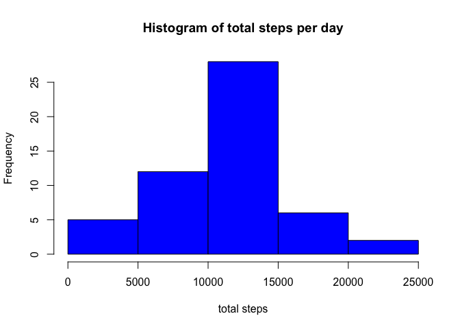
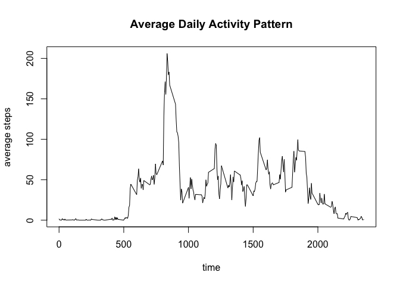
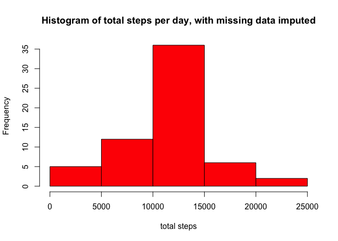
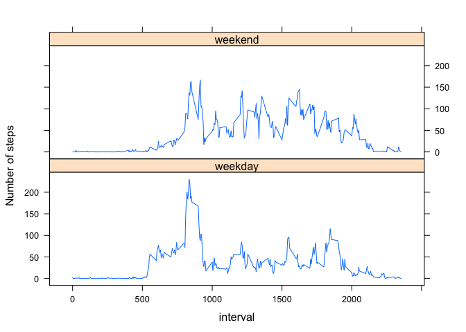

# PA1_template
Ian Kim  
3/26/2017  
# Reproducible Research Peer-graded Assignment 1


## Q1. Loading and preprocessing the data
reading the csv file per instructions of the assignment.

```r
data <- read.csv("./activity.csv")
data$date <- as.Date(data$date, format = "%Y-%m-%d")
```

## Q2. What is mean total number of steps taken per day?
Task 1 - run sum on steps per day and plot histogram. 

```r
total <- aggregate(steps ~ date, data = data, FUN = sum)
hist(total$steps, xlab = "total steps", main = "Histogram of total steps per day", col = "blue")
```

<!-- -->
Task 2 - Report mean and median of the total steps (contained in Summary)

```r
summary(total$steps)
```

```
##    Min. 1st Qu.  Median    Mean 3rd Qu.    Max. 
##      41    8841   10760   10770   13290   21190
```

## Q3. What is the average daily activity pattern?
Task 1 - calculate the average steps per interval across all days and plot them

```r
avgsteps <- aggregate(steps ~ interval, data = data, FUN = mean, rm.na = TRUE)
plot(avgsteps, type = "l", main = "Average Daily Activity Pattern", xlab = "time", ylab = "average steps")
```

<!-- -->

Task 2 - Which interval contains the max average stps?

```r
maxavg <- which(avgsteps$steps == max(avgsteps$steps))
maxinterval <- avgsteps$interval[maxavg]
```
The interval 835 has the maximum average number of steps.

## Q4. Imputing missing values
Task 1 - Calculate and report the total number of missing values in the dataset

```r
nas <- sum(!is.na(data$steps))
```
There are 15264 NAs in steps column.

Task 2 - Devise a strategy for filling in all of the missing values in the dataset. For this task we will use the averages of each 5-min interval.

```r
newdata <- data
for (i in 1:nrow(newdata)) {
    if (is.na(newdata$steps[i])) {
        avg <- avgsteps$steps[match(newdata$interval[i], avgsteps$interval)]
        newdata$steps[i] <- avg
    }
}
```

Task 3 - Make a histogram of the total number of steps taken each day and Calculate and report the mean and median total number of steps taken per day (summary will be presented).

```r
newtotal <- aggregate(steps ~ date, data = newdata, FUN = sum)
hist(newtotal$steps, xlab = "total steps", main = "Histogram of total steps per day, with missing data imputed", col = "red")
```

<!-- -->


```r
summary(newtotal$steps)
```

```
##    Min. 1st Qu.  Median    Mean 3rd Qu.    Max. 
##      41    9819   10770   10770   12810   21190
```

When NAs are replaced with the average of 5-min intervals, the mean value remained the same but the median value increased by 10. The histogram shows very similar distribution overall. 

## Q5. Are there differences in activity patterns between weekdays and weekends?
For this task a new variable of factors will be added to the dataset to indicate whether the date is weekend or weekday. Then for plotting, average steps will be calculated per interval in two different factor layers. Lattice package will be used to plot the data.

```r
for (i in 1:nrow(newdata)) {
    if (weekdays(newdata$date[i]) %in% c("Saturday","Sunday")) {
        newdata$daytype[i] <- "weekend"
    }
    else {newdata$daytype[i] <- "weekday"}
}
newdata$date <- as.factor(newdata$daytype)
library(lattice)
newavgsteps <- aggregate(steps ~ interval + daytype, data = newdata, FUN = "mean")
xyplot(newavgsteps$steps ~ newavgsteps$interval | newavgsteps$daytype, layout = c(1,2), type = "l", xlab = "interval", ylab = "Number of steps")
```

<!-- -->
